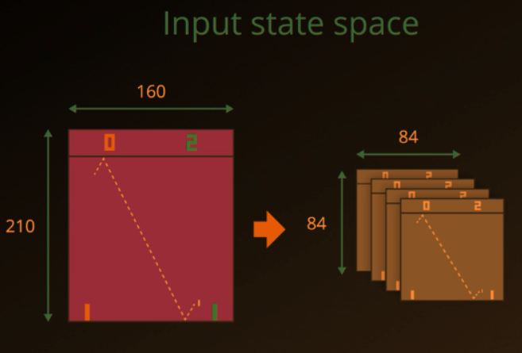
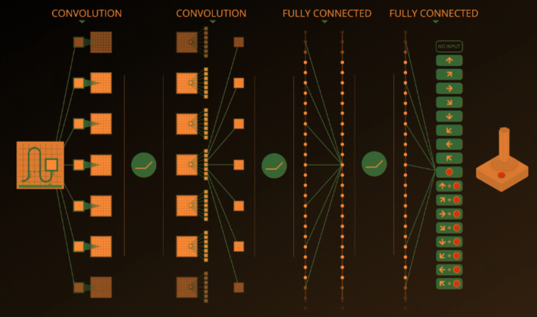

Trading_Agents
==============

**Deep Q-network**

Having a complex input state space (210,160 pixel). Google deep mind scaled the
input down to (84,84) to use GPUs more efficiently. Since in game environment we
have a sequence of inputs, the Deep mind team decided to have 4 sequence of
84x84 as the final input state.

Actions are

Experience replay can help in finding best values of the network.

Financial trading agents with the use of Q-Learning Q-Learning Agent : =()

One of the topmost topics that have huge potential in the financial industry is
the use of learning models in algorithmic stock trading. Recently there has been
an increased interest in Reinforcement Learning (RL), which has the ability to
aid an agent to act based on the price movement. While the use of RL in stock
trading agents emulates manual stock trading, it lacks the intelligence in
forecast and prediction of future price. However, these agents can act by
analyzing the current and previous data and use prediction models for future
decision making. Namely, the prediction models’ job is to add sufficient
intelligence to the agent to take advantage of price changes.

Training
--------

During the training phase, the agent uses the epsilon-greedy policy to attain
exploration and the epsilon linearly declines after each step from 1.0 to 0.1.
In addition, a simple experience replay buffer with a window of 30 is being
used. For every 100 steps, we calculate the mean value for the fixed set of
states to check the dynamics of the Q-values during the training. Also, after
each checkpoint, the reward and total gain of the model is shown. As seen in
figure 3, there are losses in reward as the cost value decreases which is a sign
of overfitting. The relation between the original price and their predicted
value of LSTM shows that the model has an adequate understanding of price
movements. But when the value of price hits the lowest or maximum the model has
the most trouble in prediction as seen in figure 3. Due to results shown, LSTM
is a favorable model among others. Even if the small variations of parameters
are being shown in table 2, a number of layers hold a vital key in performance.
Results display that as the number of layers increases, models performances will
decrease. This is due to the size of samples that model utilizes [4]. While
having more samples will require the model to contain more layers, LSTM model
generally requires a smaller number of data samples for training.

Results:
--------

The system starts buying shares and then followed by a positive trend where
agent starts to sell the stocks. The major characteristic of this approach is
the fact that if the price went down more than 30 steps, the systems start
buying stock every day until there is a rise in the system. The overall strategy
is set to buy shares until the initial investment is drained and then start
selling them if there is a positive trend in price movement. Performance of the
deep Q-Learning model can be credited to two advantages: Firstly, the capability
to sense the status of the stock from the data. Secondly, the Cost function that
adapts itself to changes in stock quickly. It must be mentioned that one of the
first problems with the agent is not knowing how many shares to buy or sell.
Although implementing this would further complicate the network, the expected
performance would increase greatly. This is one of the ways that we see in
programmed agents outperform the Q-learning model with being able to buy a
different number of shares simultaneously. Another interesting result comes from
overtraining the agent which results the agent is holding the share longer and
longer to surge the final profit.
